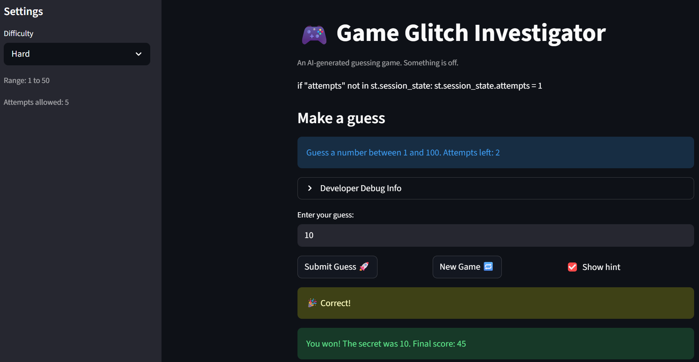

# 🎮 Game Glitch Investigator: The Impossible Guesser

## 🚨 The Situation

You asked an AI to build a simple "Number Guessing Game" using Streamlit.
It wrote the code, ran away, and now the game is unplayable. 

- You can't win.
- The hints lie to you.
- The secret number seems to have commitment issues.

## 🛠️ Setup

1. Install dependencies: `pip install -r requirements.txt`
2. Run the broken app: `python -m streamlit run app.py`

## 🕵️‍♂️ Your Mission

1. **Play the game.** Open the "Developer Debug Info" tab in the app to see the secret number. Try to win.
2. **Find the State Bug.** Why does the secret number change every time you click "Submit"? Ask ChatGPT: *"How do I keep a variable from resetting in Streamlit when I click a button?"*
3. **Fix the Logic.** The hints ("Higher/Lower") are wrong. Fix them.
4. **Refactor & Test.** - Move the logic into `logic_utils.py`.
   - Run `pytest` in your terminal.
   - Keep fixing until all tests pass!

## 📝 Document Your Experience

- [ ] Describe the game's purpose.

Glitchy Guesser is a number guessing game built with Streamlit. The player selects a difficulty level, which sets the range of the secret number, and tries to guess it within a limited number of attempts. After each guess, the game gives a directional hint (Too High / Too Low) and updates the player's score based on how quickly and accurately they guess. The twist: the starter code was intentionally shipped with bugs, and the goal of this project was to find, understand, and fix them using AI-assisted debugging tools.

- [ ] Detail which bugs you found.

Bug 1 — Attempts counter initialized to 1 instead of 0
st.session_state.attempts started at 1, meaning the game was already one attempt ahead before the player made a single guess. This caused the attempts display to be off and skewed the score calculation in update_score from the very first guess.

Bug 2 — check_guess returned inverted direction hints
When a guess was too high, the game told the player to go higher. When it was too low, it told them to go lower — the opposite of what it should say. A secondary bug caused a TypeError crash on even-numbered attempts because secret was being cast to a str before being passed into check_guess.

Bug 3 — New Game ignored difficulty and always used range 1–100
The "New Game" button hardcoded random.randint(1, 100) instead of calling get_range_for_difficulty(difficulty). This meant switching to Hard mode (range 1–50) and starting a new game would still generate a secret number up to 100, making the difficulty setting meaningless on reset.

- [ ] Explain what fixes you applied.

Bug 1 — Fixed initialization value
Changed st.session_state.attempts = 1 to st.session_state.attempts = 0 in app.py.

Bug 2 — Refactored and corrected check_guess
Moved check_guess from app.py into logic_utils.py using Copilot Agent Mode. Fixed the hint messages so guess > secret returns "Go LOWER" and guess < secret returns "Go HIGHER." Removed the TypeError except block, then separately removed the intentional str cast on secret in app.py that was causing the crash on even-numbered attempts.

Bug 3 — Fixed New Game to respect difficulty
Moved get_range_for_difficulty into logic_utils.py and updated the new_game block in app.py to call get_range_for_difficulty(difficulty) instead of hardcoding the range. Also reset status and history on new game so the app returns to a clean state.

## 📸 Demo

## 🚀 Stretch Features

- [ ] [If you choose to complete Challenge 4, insert a screenshot of your Enhanced Game UI here]
